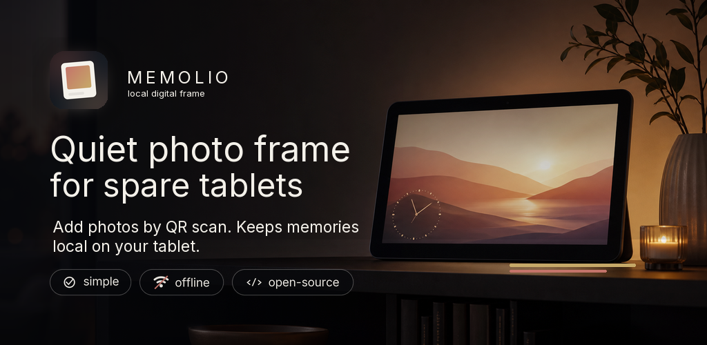

# Memolio

Memolio is an Android app that turns a spare tablet into a local digital photo frame.
Photos are added from a phone or computer on the same Wi-Fi network by scanning a QR code shown on the frame.

The app is pre-release. The current Android package is `com.baer.memolio`, with version name `0.1.0` and version code `1`.

## Features

- Fullscreen photo frame with an analog or digital clock, date, optional captions, shuffle, slideshow intervals, fit modes, and crossfade with Ken Burns motion.
- Face-aware smart crop: in fill & crop mode the crop biases toward a detected face, using an on-device (bundled, no network) face detector, with a center fallback when no face is found.
- Local browser upload page served from the tablet over Wi-Fi.
- QR upload links protected by a generated token that can be rotated in the app.
- JPEG, PNG, HEIC, HEIF, and WebP upload support.
- Private on-device photo storage with display caches and thumbnails.
- SHA-256 photo deduplication.
- Room database for photo and album metadata.
- AndroidX DataStore for app settings.
- Recently Deleted storage area with optional 30-day cleanup.
- Localized app text and upload-page text for English, German, French, Italian, Dutch, Polish, Portuguese, Spanish, Russian, and Simplified Chinese.

## Free and Pro

Free includes the frame, Wi-Fi upload, one photo pool, slideshow settings, storage management, language selection, and built-in wallpapers.

Pro-gated features in the current tree:

- Albums and album-based playlists.
- Appliance features: auto-start on boot, kiosk lock, Home-app mode, scheduled sleep, and ambient dimming.
- Custom wallpaper: import your own image as the frame background.

The built-in wallpapers are `default` (a live vector background), `ember`, and `slate`, and are free. Importing a custom wallpaper is Pro.

Pro purchase and restore use RevenueCat over Google Play Billing. After a successful purchase or restore, the entitlement is stored locally so the frame can keep running offline.

## Privacy

Memolio has no accounts, analytics, ads, crash-reporting SDKs, or cloud photo storage.

Photos uploaded through the QR page go directly from the uploader's browser to the tablet over the local network. They are not sent to a Memolio backend. The app only makes outbound purchase-related calls when the user buys or restores Pro.

The app does not request broad photo or media-library permissions. It manages files inside its own private app storage.

See [docs/privacy-policy.md](docs/privacy-policy.md) for the privacy policy draft.

## Tech stack

- Kotlin Android app with Jetpack Compose and Material 3.
- Hilt, Room, DataStore, WorkManager, Ktor CIO, Coil, ZXing, ML Kit face detection, and RevenueCat Purchases.
- Tests use Robolectric, Compose UI testing, Truth, Turbine, Room testing, WorkManager testing, and Roborazzi.

## Repository

- App code: `app/src/main/java/com/baer/memolio/`
- Upload page: `app/src/main/assets/upload.html`
- Room schemas: `app/schemas/`
- Docs and mockups: `docs/`

## License

Memolio is licensed under the GNU General Public License version 3. See [LICENSE](LICENSE).
